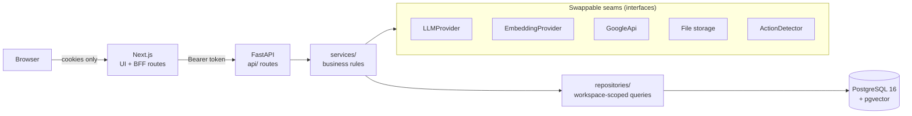
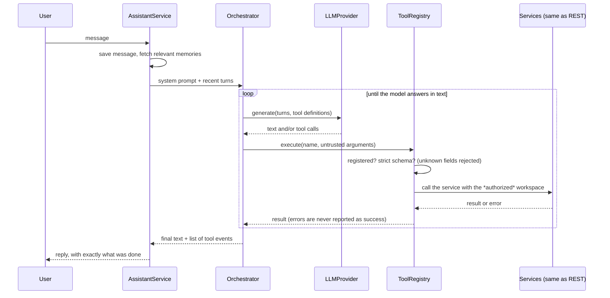
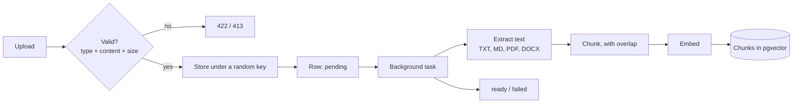

# Architecture

Veluntra is a personal operations system: tasks, notes, documents, memory, search, Google
data and an AI assistant over all of it. This document explains how it is put together and
why. (The original product brief is in [PROJECT_CONTEXT.md](PROJECT_CONTEXT.md).)

## The big picture

- **Next.js is a backend-for-frontend.** The browser never holds an API token: sign-in stores
  both tokens in `httpOnly` cookies, and `/api/backend/*` is an authenticated proxy that attaches
  the token and refreshes it when it expires.
- **The API is layered, and each layer has one job.** `api/` parses HTTP and authorizes;
  `services/` holds the rules; `repositories/` is the only code that writes queries, and every
  query is scoped by workspace. Routes never touch the database directly.
- **Everything that varies by environment sits behind an interface** (the "seams" above), each
  with a built-in offline implementation, so the whole app runs and is tested with no keys,
  accounts or network.

## Data model

Everything belongs to a **workspace**; a user is a member of one or more.

| Table | Holds |
|---|---|
| `users`, `refresh_tokens`, `workspaces`, `workspace_members` | Accounts, rotating refresh tokens, tenancy and roles |
| `tasks` | Status, priority, due date, full-text search column |
| `notes` | Title, content, tags, full-text search column |
| `documents`, `document_chunks` | Uploaded files and their embedded passages (pgvector) |
| `memories` | Durable facts with provenance (source type, id, label, confidence) and an embedding |
| `conversations`, `messages` | Assistant chats, including the tool calls made for each reply |
| `integration_accounts` | A user's Google connection, tokens encrypted |
| `suggestions` | Tasks proposed from email, waiting for the user to accept or dismiss |

Enums are stored as plain strings (not Postgres enum types) so adding a value is a code change,
not a migration. Schema changes are Alembic migrations, and CI fails if the models and
migrations drift apart.

## The AI assistant

The model decides *what* should happen; only application services can *do* it. Model output is
untrusted input. Workspace and user come from the authenticated request, never from the model.
There are no delete or send tools. Only the last few messages and a few relevant memories are
sent as context. The `LLMProvider` interface (`app/llm/types.py`) is the only thing a real model
adapter must implement; a free, local one for Ollama is included (`app/llm/ollama.py`, with matching
embeddings in `app/embeddings/ollama.py`; see [OLLAMA_SETUP.md](OLLAMA_SETUP.md)).

Tools: tasks, notes, documents, memories, unified search, Google (email, calendar, Drive),
and the daily briefing.

## Documents

The upload returns immediately; processing claims the row atomically (so two workers can't both
take it), records failure with a user-safe reason, and can be retried. Documents interrupted by a
restart are marked failed at startup.

## Search

One endpoint searches four kinds of content, each the way that suits it:

- **Tasks and notes:** Postgres full-text search (stemmed, weighted title over body) plus
  structured filters. Plain SQL answers these reliably, so no vectors are used.
- **Documents and memories:** semantic search by cosine similarity (pgvector HNSW index).
- **Combining:** each source is scored on 0 to 1 and merged. A text match is a precise hit and
  scores 0.6 to 1.0; semantic scores are cosine similarity, with anything under 0.2 dropped.
- **Filters inside the query** (`priority:high`, `is:overdue`, `tag:work`, `kind:person`,
  `type:notes`): a filter keeps only the content it applies to, and filter-only queries list
  matches by recency. Text that isn't the user's own (event titles, emails) is searched as plain
  words, never parsed for operators.

## Memory

Memory is not "every sentence". The assistant saves a fact through a `remember` tool only when
it is durable (a person, preference, commitment, decision...), says so in its reply, and records
where it came from. Near-duplicates are refused, the count is capped, and memories can be edited
or forgotten in the UI. The assistant cannot delete them.

## Google integration

OAuth with a signed, short-lived `state` bound to user and workspace; read-only scopes only;
tokens encrypted at rest and refreshed on demand; a revoked connection is flagged for
reconnection instead of failing silently. `GOOGLE_PROVIDER=demo` swaps in canned data so the
whole feature can be tried without credentials. Details: [GOOGLE_SETUP.md](GOOGLE_SETUP.md).

## Proactive intelligence

- **Daily briefing:** assembled from the user's own data with ordinary queries and explainable
  rules (no model): ranked priorities with reasons, overdue and due tasks, today's meetings with
  related documents and notes, follow-ups, suggested next steps. Google parts degrade
  gracefully when Google isn't connected.
- **Suggestions:** a rule-based detector looks for requests in recent email and for sent mail
  nobody answered. It only *proposes*; nothing becomes a task until the user accepts it.

## Decisions worth knowing

| Decision | Why |
|---|---|
| Services are the only way to change data, for REST and AI alike | One set of rules and workspace checks; the AI can't do anything the API can't |
| Interfaces with offline implementations for model, embeddings, Google, storage | The whole app is runnable and testable for free, and real providers are an adapter away |
| Suggestions and approval instead of autonomous actions | Trust: the assistant proposes, the user decides |
| Postgres for relational data, full-text and vectors | One system to run and back up; SQL where SQL is reliable, vectors where meaning matters |
| Background work in-process with database-tracked status | No extra infrastructure to start; the state machine makes a move to a job queue straightforward |
| Provenance on memories and suggestions | Users can judge how far to trust something the assistant stored or proposed |

## Testing

Over 350 backend tests, run on every push:

- API tests drive the real app against a real Postgres (with pgvector) through the real
  migrations: isolation between workspaces, validation, error shapes, permissions.
- The AI pipeline is tested with scripted model replies, including hostile ones: unknown tools,
  extra arguments, failing tools.
- The real Google HTTP client is tested against canned Google responses; flows use a fake client.
- Pure logic (chunking, deadlines, ranking, detection, conflicts) has direct unit tests.
